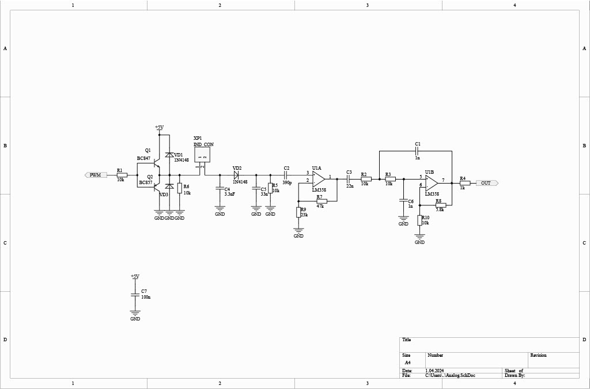
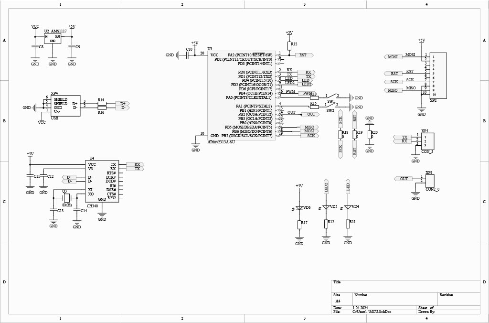
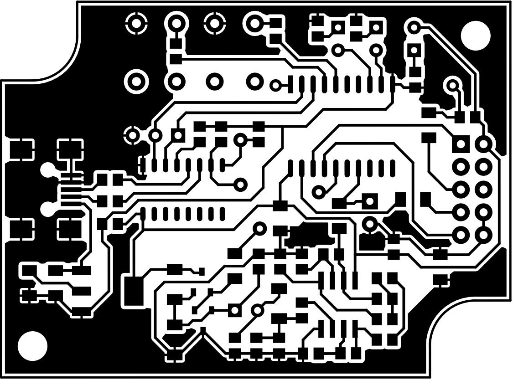

# About

Attiny2313 RFID USB reader for 125kHz ID cards.

# Features

* USB Interface
* One layer PCB which makes it easy to make one at home
* Small dimensions (50x65x18mm)
* 3 buttons to interface with
* 3 LEDs to display status

# Schematics

# PCB Top View

